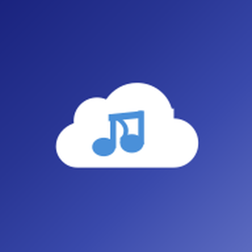
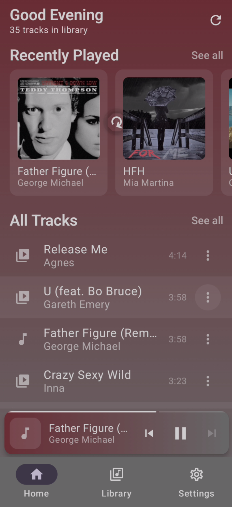
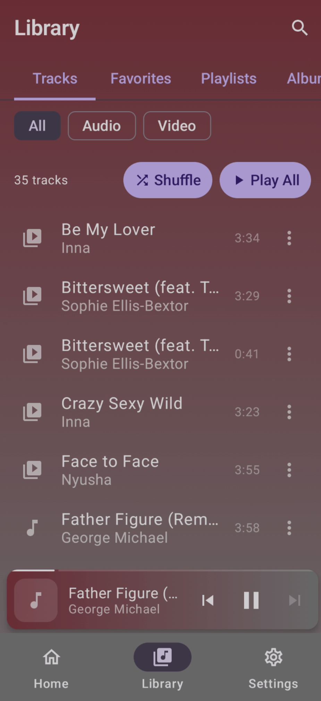
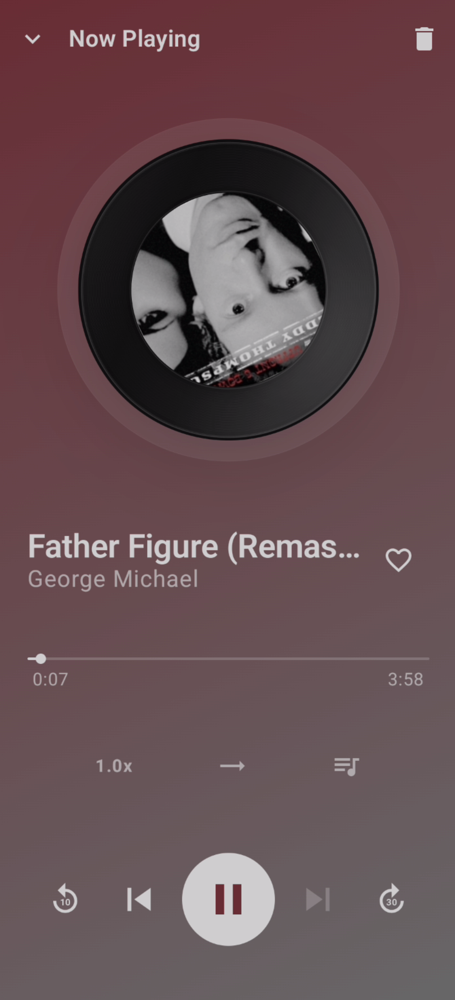
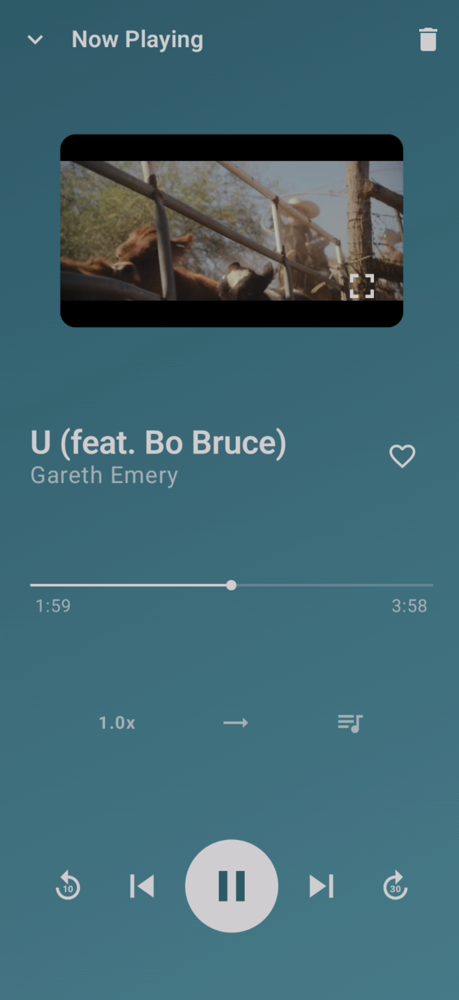
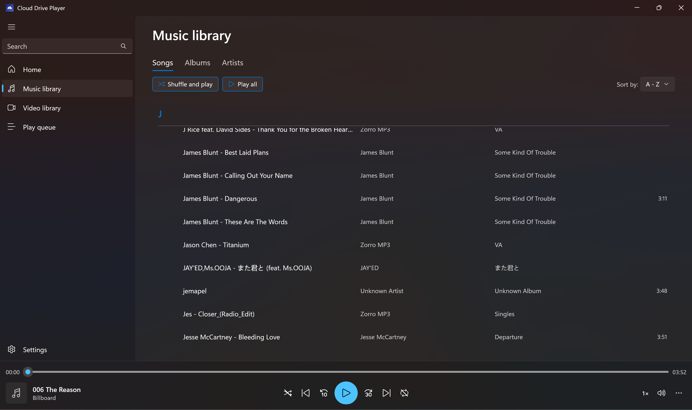

# Cloud Drive Player

Stream your music and videos directly from **OneDrive** or **Google Drive** — no downloading required.

Available now on **[Google Play](https://play.google.com/store/apps/details?id=com.arisewang.clouddriveplayer)** (Android) and **[Microsoft Store](https://apps.microsoft.com/detail/9pfxngjljn2p)** (Windows).

  

  <a href="https://play.google.com/store/apps/details?id=com.arisewang.clouddriveplayer">Google Play</a> ·
  <a href="https://apps.microsoft.com/detail/9pfxngjljn2p">Microsoft Store</a> ·
  <a href="https://clouddriveplayer.redraintech.com/">Website</a> ·
  <a href="https://clouddriveplayer.redraintech.com/PRIVACY_POLICY.html">Privacy Policy (Android)</a> ·
  <a href="https://clouddriveplayer.redraintech.com/PRIVACY_POLICY_WINDOWS.html">Privacy Policy (Windows)</a> ·
  <a href="mailto:clouddriveplayer@outlook.com">Contact</a>

---

## Features

### Android Version
- Available on Google Play: https://play.google.com/store/apps/details?id=com.arisewang.clouddriveplayer
- Feedback email: clouddriveplayer@outlook.com

### Windows Version
- Available on Microsoft Store: https://apps.microsoft.com/detail/9pfxngjljn2p
- Sign in with OneDrive or Google Drive to stream your music and videos on desktop

### Cloud Streaming
- Stream audio and video directly from OneDrive or Google Drive
- No need to download files — play instantly from the cloud
- Smart streaming cache with configurable size limit

### Offline Mode
- Download entire folders for offline playback
- Cloud-aware sync keeps offline files up to date
- Play your music anywhere, even without internet

### Audio Player
- Beautiful Now Playing screen with spinning vinyl record and album art
- Dynamic theming — app colors adapt to current album art
- Playback speed control, shuffle, repeat modes
- Favorites and playlists

### Video Player
- Inline video playback in the Now Playing screen
- Fullscreen landscape video player with gesture controls
- Auto-enters fullscreen on device rotation

### External Display Output
- Connect via **HDMI or USB-C** to play video on an external monitor or TV
- Phone becomes a controller — transport controls, seek bar, and track info on your phone screen
- Toggle with the TV icon in the video player top bar

### Android Auto
- Full Android Auto integration for safe driving
- Browse your library by recently played, favorites, albums, artists, and playlists
- Album art, playback controls, and search support

### Home Screen Widgets
- 4×1 and 4×2 home screen widgets with album art, progress bar, and transport controls
- Dynamic album art colors on widget background
- Cold-start restore — widget controls work even when the app is closed

### Localization
- 21 languages supported: Arabic, Chinese (Simplified & Traditional), Dutch, English, French, German, Hindi, Indonesian, Italian, Japanese, Korean, Malay, Polish, Portuguese (Brazil), Russian, Spanish, Swedish, Thai, Turkish, Ukrainian, Vietnamese

---

## Supported Formats

### Android Version
| Type | Formats |
|------|---------|
| Audio | MP3, M4A, AAC, FLAC, OGG, Opus, WAV |
| Video | MP4, MKV, WebM, AVI, MOV, M4V, WMV, FLV, TS, 3GP |

### Windows Version
Guaranteed (must pass):

| Type | Formats |
|------|---------|
| Audio | MP3, M4A/AAC-LC, WAV (PCM), FLAC |
| Video | MP4 (H.264 + AAC), M4V (H.264 + AAC) |

Best effort (playability may vary by codec/system):

| Type | Formats |
|------|---------|
| Audio | OGG Vorbis, OGG Opus |
| Video | MKV (H.264 + AAC), MOV (H.264 + AAC), MP4 (HEVC/H.265 + AAC), VP9 (WebM/MP4), AV1 (MP4) |

---

## Keyboard Shortcuts

Cloud Drive Player supports keyboard shortcuts on both Android and Windows platforms.

### Android (Physical Keyboard)

When using a physical keyboard (Bluetooth keyboard, Samsung DeX, Android TV, tablet, etc.):

#### Now Playing Screen
| Key | Action |
|-----|--------|
| **F** | Enter fullscreen video player (video tracks only) |

#### Fullscreen Video Player
| Key | Action |
|-----|--------|
| **Space** | Play / Pause |
| **←** | Seek back 10 seconds |
| **→** | Seek forward 10 seconds |
| **↑** | Previous track |
| **↓** | Next track |
| **F** | Exit fullscreen (return to Now Playing) |
| **P** | Toggle external display output |
| **Escape** | Exit fullscreen |

Media keys (play/pause, rewind, fast-forward) are also supported. All shortcuts are disabled when controls are locked.

### Windows Desktop

The Windows version supports these global keyboard shortcuts:

| Key | Action |
|-----|--------|
| **Space** | Play / Pause |
| **N** | Next track |
| **P** | Previous track |
| **→** | Seek forward 30 seconds |
| **←** | Seek back 10 seconds |
| **F11** or **F** | Toggle fullscreen video mode |
| **Escape** | Exit fullscreen |

**Note:** Keyboard shortcuts are disabled when typing in text fields (search box, etc.).

## Screenshots

### Android

  
  
  
  

### Windows

  

---

## Feedback

If you encounter issues, have suggestions, or want to request features, please [open an issue](https://github.com/arisewanggithub/CloudDrivePlayer/issues) in this repository.

Thank you for using Cloud Drive Player!
